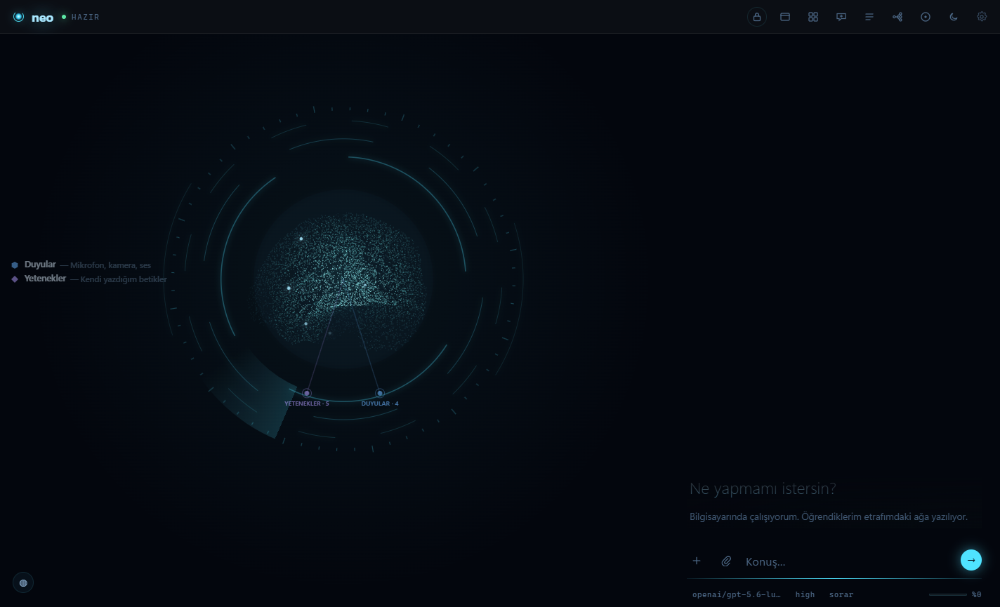
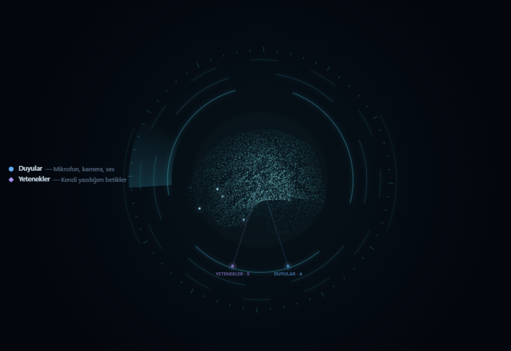
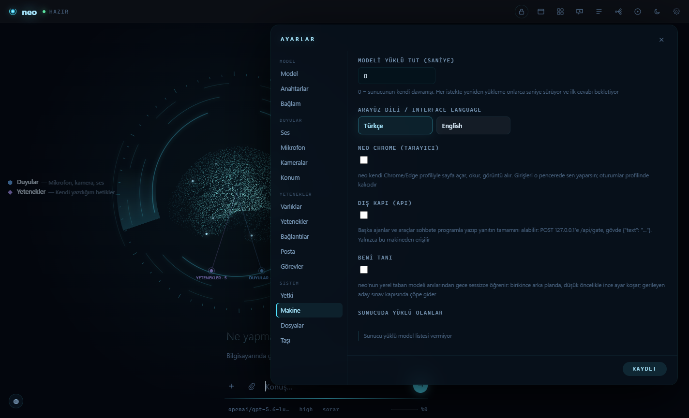

# neo

**A local-first personal AI agent with a living, brain-like memory.**

[Türkçe README](README.tr.md)

neo is not a coding assistant. It is a personal agent that lives on your
computer, can use the computer the way you do — screen, mouse, keyboard,
browser, files — and whose memory, goals and history are first-class,
queryable structures. What it learns about you is written into a memory
network that you can literally watch grow on screen.



## What's inside

* **Living memory.** Every conversation leaves memories. Recall is served by
  a SQLite FTS5 index plus a 256-bit fingerprint (SimHash) layer — one XOR
  per comparison — so recall stays ~constant time whether you have 1 memory
  or 50,000. New memories link themselves to their nearest neighbours; the
  network wires itself over time.
* **A tiny brain of its own.** A 10.8M-parameter byte-level model (the
  *base rewriter*) expands your question with synonyms, abbreviations and
  pronoun resolutions before the memory search. It runs in pure numpy on
  CPU, in milliseconds, fully offline. It ships with the repo
  (`src/neocp/assets/taban.npz`, ~20 MB).
* **"Learn me" night school.** With the switch on, neo quietly fine-tunes
  its base rewriter on *your* memories at night, on your machine, at low
  priority. Every candidate model must pass an exam gate — beat the current
  model on the benchmark, keep silence on trap questions, stay fast — or it
  is discarded. Your data never leaves the computer.
* **Computer use.** Screen capture, mouse/keyboard control, window
  management, and a real browser driven over the DevTools protocol
  (`neo chrome`) — sessions and logins persist in its own profile.
* **External gate (API).** Other agents and tools can talk to neo
  programmatically: `POST /api/gate` on `127.0.0.1` with
  `{"text": "..."}` returns the full answer. Off by default.
* **MCP connectors and skills.** Connect Model Context Protocol servers
  from the settings page; neo also writes and keeps its own skills
  (small scripts it learns to reuse).
* **Model-agnostic.** Anthropic API or any OpenAI-compatible server —
  LM Studio, Ollama, vLLM, llama.cpp, OpenRouter.
* **Turkish and English** interface; the memory layer is built for
  agglutinative Turkish (prefix-matching FTS) and works in English too.



## Quick start

### From the installer (Windows)

Download `neo-setup-<version>.exe` from
[Releases](../../releases), run it, and launch **neo** from the Start menu.
The setup page in the app lets you pick a model (local server or API key).
Optional installer components: know-me training, listening (microphone),
camera watching.

### From source

```bash
git clone https://github.com/fatihkutuk/neo
cd neo
pip install -e ".[app,local]"
neocp setup     # probes LM Studio / Ollama / vLLM / API keys
neocp --app     # desktop window (WebView2)
```

| command | what it does |
|---|---|
| `neocp --app` | desktop window |
| `neocp` | terminal REPL |
| `neocp --web` | browser UI at `127.0.0.1:8765` |
| `neocp --resume` | continue the last session |
| `neocp --mode plan` | read-only mode |

On first launch the mind is empty. It fills itself as you talk; by the
second session it starts remembering you.

## Architecture

### Memory flow


A question first passes through the base rewriter, which adds the terms the
search will actually need (synonyms, expansions, resolved pronouns) — or
stays silent when nothing useful can be added. The expanded query hits two
indexes (term catalog + fingerprints), a calibrated union filters the
candidates, and only the relevant cards reach the model's context.

Measured on the project's scale benchmark:

* retrieval accuracy **0.87 → 0.93** with the base rewriter in front
* synonym-phrased questions **0.50 → 1.00**
* full query expansion ~**300 ms** on CPU, once per message; early
  silence (nothing to add) in under 50 ms
* recall latency ~**0.05 ms** at 1 record *and* at 50,001 records

### Night school


The nightly personal loop harvests new memories, distills question→term
pairs from them, fine-tunes the base model at low priority, and then sits
the candidate down for an exam. Only a candidate that beats the deployed
model gets deployed. Everything runs locally.

### Settings



## Training rig

The [`training/`](training/) directory contains the full, self-sufficient
training rig for the base rewriter — **data included**: the ~164.5k-example
bilingual teacher corpus, the trained base checkpoint
(`training/checkpoints/base.pt`), and every script from corpus generation
through the acceptance exam and the nightly personal loop. Anyone can
retrain or improve the model; see [`training/README.md`](training/README.md)
for the pipeline, the frozen data format and the knobs worth turning.


## Evaluation

We handed neo three coding tasks (easy / medium / hard) through the external
gate API and audited everything independently — then ran the same tasks with
the evaluator itself and with neo's own model bare over the raw API, one-shot.
neo scored **294/300**, matching its evaluator (289) and beating its own bare
model (280): same model, +14 points inside the harness and zero broken
deliveries. Full write-up: [docs/evaluation.md](docs/evaluation.md)
([Türkçe](docs/evaluation.tr.md)).

## Roadmap

* Stronger English base model (training data is currently Turkish-heavy)
* More senses: continuous listening and camera watching are in, more to come
* Windows is the primary target today; broader platform support later

## Contributing

Feature branches → pull request → `main` (protected). See
[CONTRIBUTING.md](CONTRIBUTING.md). Note: **code identifiers and comments
are in Turkish** by project convention.

## Credits

neo is developed jointly by **Fatih Kütük** and **Claude (Anthropic)** —
the architecture, the code and the ideas in this repository grew out of
that collaboration.

## License

[MIT](LICENSE) © 2026 Fatih Kütük
