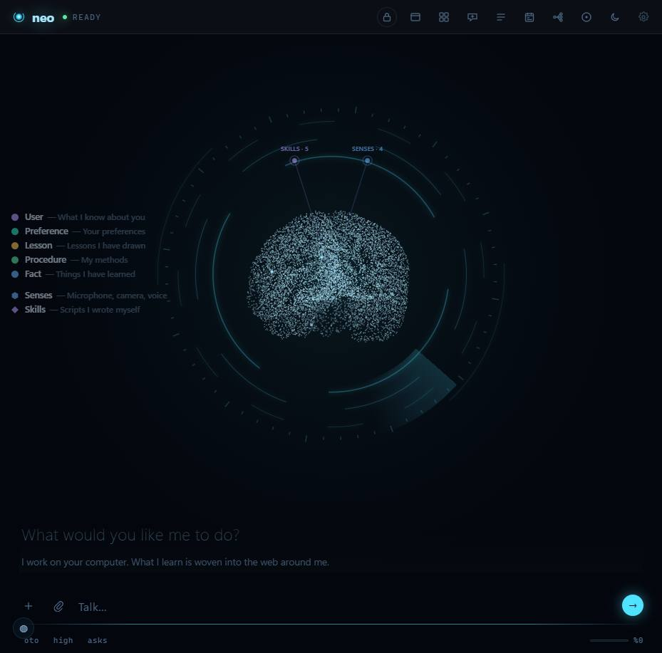
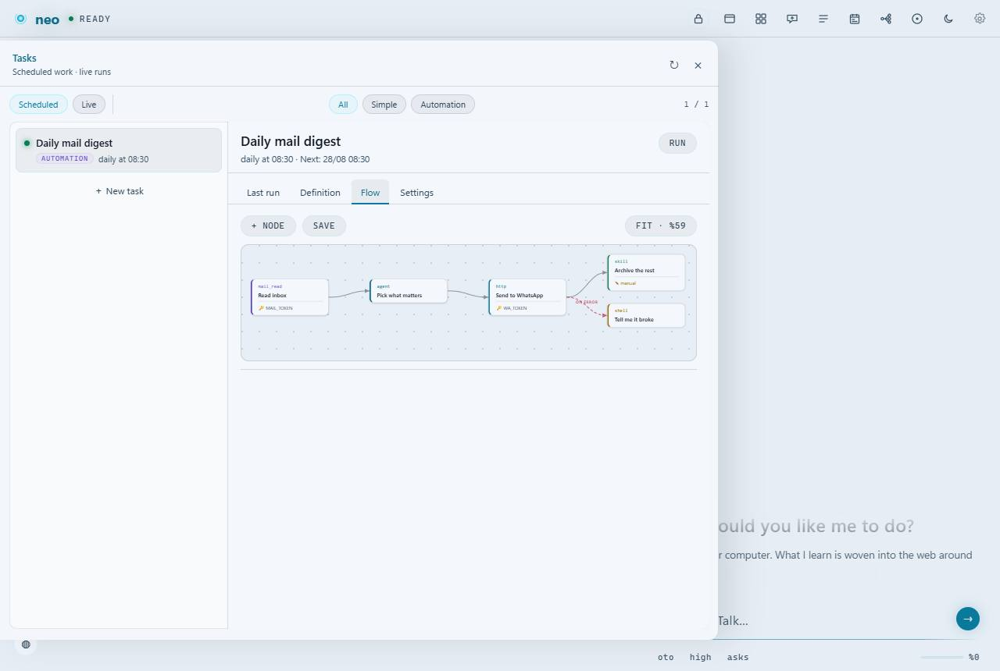
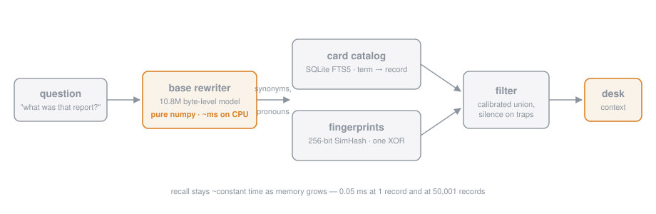
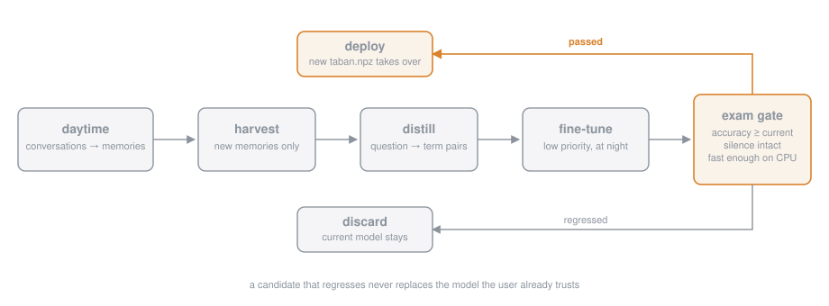
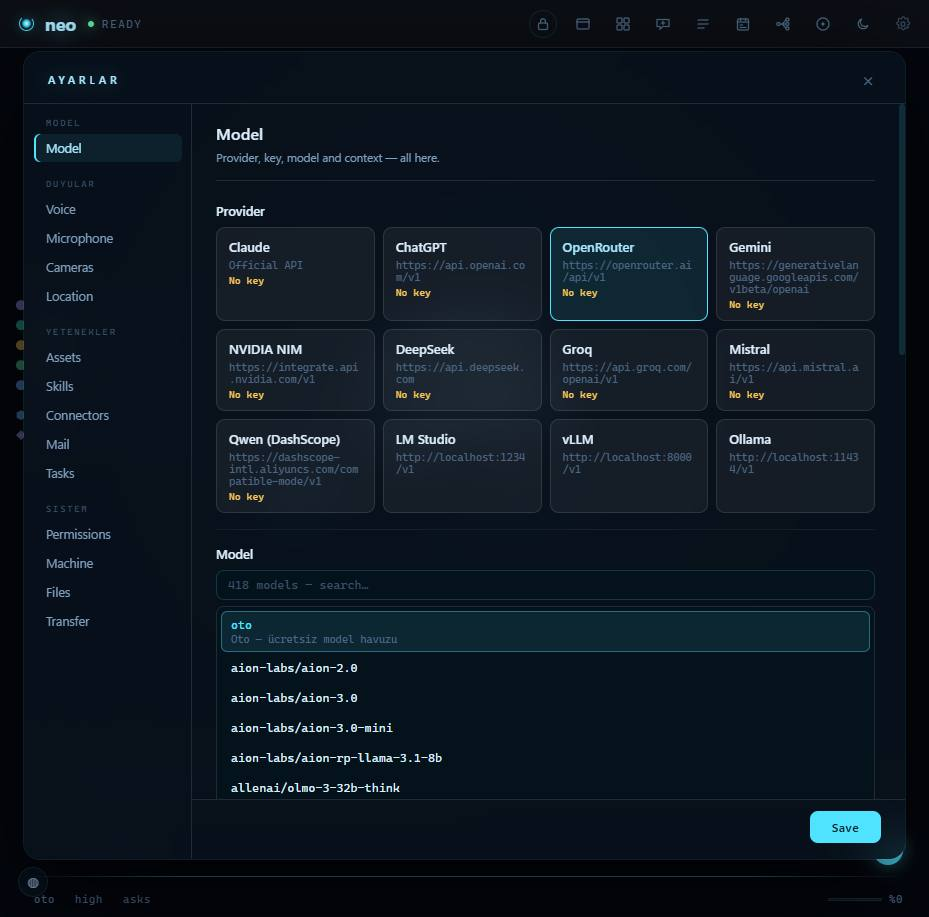
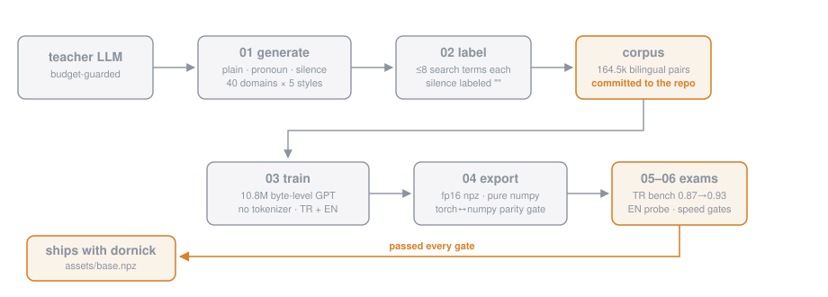

# neo — a local-first personal AI agent with a living memory

**Open-source, self-hosted AI assistant for Windows that remembers you,
uses your computer, and builds its own automations.**

[Türkçe README](README.tr.md) · [Releases](../../releases) · MIT licensed

neo is not a coding assistant. It is a personal AI agent that runs on *your*
machine, uses the computer the way you do — screen, mouse, keyboard, browser,
files — and keeps its memory, goals and history as first-class, queryable
structures instead of an appended notes file. What it learns about you is
written into a memory network you can watch grow on screen.

It works with **any model**: Anthropic's API, OpenRouter, or a local server —
LM Studio, Ollama, vLLM, llama.cpp. Your conversations and memories never
leave the machine unless you point it at a hosted model.


More screenshots — light/dark shells, viewer tabs, the connectors
directory, a live session with a real model: [the gallery](docs/galeri/README.md).

## Why it's different

Most assistants forget you between sessions, or paste a notes file into the
prompt and call it memory. neo keeps an actual associative network, ships a
small model of its own that learns *your* vocabulary overnight on your CPU,
and turns repeated work into automations you can watch run step by step.

| | most assistants | neo |
|---|---|---|
| Memory | a text file in the prompt | associative graph, ~constant-time recall at 50k records |
| Learning | none — the model is fixed | nightly on-device fine-tune, gated by an exam |
| Repeated work | you re-ask every time | automations: a step graph on a schedule |
| Where it runs | someone's cloud | your machine; local models supported |
| Proof | screenshots | measured benchmarks in this repo ([latest](docs/benchmark-2026-08.md)) |

## What's inside

* **Living memory.** Every conversation leaves memories. Recall is served by
  a SQLite FTS5 index plus a 256-bit fingerprint (SimHash) layer — one XOR
  per comparison — so recall stays ~constant time whether you have 1 memory
  or 50,000. New memories link themselves to their nearest neighbours; the
  network wires itself over time.
* **A tiny brain of its own.** A 10.8M-parameter byte-level model (the
  *base rewriter*) expands your question with synonyms, abbreviations and
  pronoun resolutions before the memory search. It runs in pure numpy on
  CPU, in milliseconds, fully offline. It ships with the repo
  (`src/neocp/assets/taban.npz`, ~20 MB).
* **"Learn me" night school.** With the switch on, neo quietly fine-tunes
  its base rewriter on *your* memories at night, on your machine, at low
  priority. Every candidate model must pass an exam gate — beat the current
  model on the benchmark, keep silence on trap questions, stay fast — or it
  is discarded. Your data never leaves the computer.
* **Automations you can watch run.** A repeated job — "every morning, read
  my mail, pick what matters, send it to me on WhatsApp" — becomes a graph of
  steps, not a prompt you retype. Ask the agent and it builds the flow; you
  can open any step and edit it by hand. Steps light up as they run, so you
  see where it is, and the output stays on the same screen. If a step breaks,
  neo repairs it once and retries — but it never rewrites a step you edited
  yourself, and it always says what it changed.
* **Computer use.** Screen capture, mouse/keyboard control, window
  management, and a real browser driven over the DevTools protocol
  (`neo chrome`) — sessions and logins persist in its own profile, forms get
  filled, and neo reads the console and network log to tell "the page opened"
  apart from "the page works".
* **Work in your own repo.** Point neo at a project folder and it works
  *there* — not in a sandbox corner. Every file it writes is compiled or
  linted on the spot (`compile()`, `php -l`, `node --check`, `tsc`, ruff), and
  the `kos` tool finds the project's real test command from evidence and runs
  it. It never invents a test command it cannot justify.
* **Your rules, enforced.** `.neocp/kancalar.json` lets you run your own shell
  command before or after any tool; a non-zero exit **vetoes** the tool.
  Deliberately outside the permission prompt — your own rule shouldn't ask
  your permission — and the hook file is closed to the model: the write tools
  refuse it by path, and any other *mutating* call that names it (a shell
  command, say) is refused before the permission gate. Reading it is allowed;
  the model should know the rules it works under. Honest boundary: this stops
  a model that decides a hook is in its way, not one deliberately hiding the
  filename — against that, the fence is the permission engine.
* **External gate (API).** Other agents and tools can talk to neo
  programmatically: `POST /api/gate` on `127.0.0.1` with
  `{"text": "..."}` returns the full answer. Off by default.
* **MCP connectors and skills.** Connect Model Context Protocol servers
  from the settings page; neo also writes and keeps its own skills
  (small scripts it learns to reuse).
* **Model-agnostic.** Anthropic API or any OpenAI-compatible server —
  LM Studio, Ollama, vLLM, llama.cpp, OpenRouter.
* **Turkish and English** interface; the memory layer is built for
  agglutinative Turkish (prefix-matching FTS) and works in English too.



## Quick start

### From the installer (Windows)

Download `neo-setup-<version>.exe` from
[Releases](../../releases), run it, and launch **neo** from the Start menu.
The setup page in the app lets you pick a model (local server or API key).
Optional installer components: know-me training, listening (microphone),
camera watching.

**Installing over an existing copy** gives you three choices, and the
installer is tested against all of them:

| choice | what happens to your code | what happens to your data |
|---|---|---|
| **Update** (default) | replaced | kept — memories, tasks, automations untouched |
| **Clean install** | wiped and rewritten | kept |
| **Reset data too** | wiped and rewritten | deleted — **after** a backup zip is written |

A backup zip is taken before anything is removed; if the backup fails,
nothing is deleted. The last five backups are kept. Uninstalling removes the
program and leaves your `.neocp` data in place.

### From source

```bash
git clone https://github.com/fatihkutuk/neo
cd neo
pip install -e ".[app,local]"
neocp setup     # probes LM Studio / Ollama / vLLM / API keys
neocp --app     # desktop window (WebView2)
```

| command | what it does |
|---|---|
| `neocp --app` | desktop window |
| `neocp` | terminal REPL |
| `neocp --web` | browser UI at `127.0.0.1:8765` |
| `neocp --resume` | continue the last session |
| `neocp --mode plan` | read-only mode |

On first launch the mind is empty. It fills itself as you talk; by the
second session it starts remembering you.

## Driving neo from other agents

neo exposes a single local endpoint — the gate — that lets any other
harness (Claude Code, OpenCode, a script, CI) hand it a task and collect
the full result: answer, tools used, files changed, session log. It is how
the benchmark rig drives isolated instances. One curl to enable, one curl
to ask: [docs/gate.md](docs/gate.md).

## Automations


Each node names its type (`mail_read`, `agent`, `http`, `skill`), the secrets
it needs, and whether you edited it by hand — a step marked ✎ *manual* is one
the automatic repair will never touch. The same screen works in both themes:



Run it on a schedule, or press **Run** and watch the steps turn from
*running* to *done*. Nothing is hidden in a separate log.

## Architecture

### Memory flow



A question first passes through the base rewriter, which adds the terms the
search will actually need (synonyms, expansions, resolved pronouns) — or
stays silent when nothing useful can be added. The expanded query hits two
indexes (term catalog + fingerprints), a calibrated union filters the
candidates, and only the relevant cards reach the model's context.

Measured on the project's scale benchmark:

* retrieval accuracy **0.87 → 0.93** with the base rewriter in front
* synonym-phrased questions **0.50 → 1.00**
* full query expansion ~**300 ms** on CPU, once per message; early
  silence (nothing to add) in under 50 ms
* recall latency ~**0.05 ms** at 1 record *and* at 50,001 records

### Night school



The nightly personal loop harvests new memories, distills question→term
pairs from them, fine-tunes the base model at low priority, and then sits
the candidate down for an exam. Only a candidate that beats the deployed
model gets deployed. Everything runs locally.

### Settings



## Training rig

The [`training/`](training/) directory contains the full, self-sufficient
training rig for the base rewriter — **data included**: the ~164.5k-example
bilingual teacher corpus, the trained base checkpoint
(`training/checkpoints/base.pt`), and every script from corpus generation
through the acceptance exam and the nightly personal loop. Anyone can
retrain or improve the model; see [`training/README.md`](training/README.md)
for the pipeline, the frozen data format and the knobs worth turning.



## Evaluation

We handed neo three coding tasks (easy / medium / hard) through the external
gate API and audited everything independently — then ran the same tasks with
the evaluator itself and with neo's own model bare over the raw API, one-shot.
neo scored **294/300**, matching its evaluator (289) and beating its own bare
model (280): same model, +14 points inside the harness and zero broken
deliveries.

That grading was done by hand, so it was turned into a rig that lives in the
repo: [`eval/coding/`](eval/coding/README.md). Nine tasks in Python, Node and
PHP; each runs in its own temp workspace with an empty mind and its own neo
instance, and the grader **executes the delivered code** rather than checking
that files exist.

The rig's biggest outing so far: a **three-harness benchmark** (Aug 2026) —
Claude Code, OpenCode and neo, the latter two on the *same* ~free flash
model. Result on the 9-task sweep: Claude Code 897.3, **neo 896.7**,
OpenCode 894.9 (out of 900) — a statistical tie in quality with the
reference agent, on a model that costs cents, with neo ahead of the
same-model competitor. The efficiency story (cache rates, reasoning-spiral
failure modes, what the delivery gates catch) and two measured memory
experiments are written up with raw data in
[docs/benchmark-2026-08.md](docs/benchmark-2026-08.md). Earlier hand-graded
write-up: [docs/evaluation.md](docs/evaluation.md)
([Türkçe](docs/evaluation.tr.md)).

## Roadmap

See [docs/parity.md](docs/parity.md) for the full agentic parity map —
what matches the current harness landscape, where neo is ahead (the
user-learning model, the living memory, memory-as-MCP, the gate), and
what is deliberately deferred:

* OS-level shell sandboxing; a real LSP instead of the `ast`/regex
  approximation behind the `semboller` tool
* Typed subagent definitions; MCP client-side OAuth
* Memory-informed coding — the coding pipeline still runs with an empty mind
* Stronger English base model; broader platform support (Windows-first today)

## Contributing

Feature branches → pull request → `main` (protected). See
[CONTRIBUTING.md](CONTRIBUTING.md). Note: **code identifiers and comments
are in Turkish** by project convention.

## Credits

neo is developed jointly by **Fatih Kütük** and **Claude (Anthropic)** —
the architecture, the code and the ideas in this repository grew out of
that collaboration.

## License

[MIT](LICENSE) © 2026 Fatih Kütük

---

<sub>Keywords: open-source AI agent · local-first personal assistant ·
self-hosted LLM agent · AI with long-term memory · LM Studio / Ollama /
llama.cpp / vLLM client · OpenRouter desktop app · Anthropic Claude API
client · AI workflow automation · agent with cron scheduling · computer-use
agent for Windows · on-device fine-tuning · MCP client and server ·
Python AI agent framework</sub>
