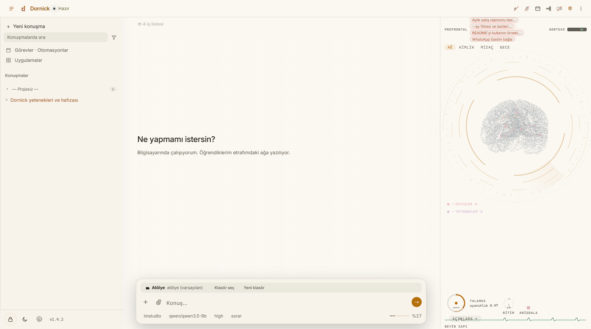

# neo — yaşayan hafızalı, yerel-öncelikli kişisel yapay zekâ ajanı

[English README](README.md) — ayrıntının tamamı orada; bu sayfa kısa Türkçe özet.

neo bir kod asistanı değil: bilgisayarında yaşayan, hafızası-hedefleri-
geçmişi birinci sınıf yapılar olan kişisel bir ajan. Hakkında öğrendikleri,
ekranda büyüdüğünü izleyebildiğin bir hafıza ağına yazılır. Her modelle
çalışır: Anthropic, OpenRouter ya da yerel sunucu (LM Studio, Ollama,
vLLM). Yerel modelde konuşmaların ve anıların makineden çıkmaz.



## İçinde ne var

* **Yaşayan hafıza.** FTS5 + 256-bit parmak izi; tarama doğrusal ama kayıt
  başına iş tek XOR — 50.000 anıda ~5 ms, bir model çağrısının binde biri.
  Yeni anı en yakın komşularına kendiliğinden bağlanır.
* **Kendine ait minik beyin.** 10.8M paramlı bayt-düzeyi taban yazıcı,
  aramadan önce soruyu eş anlamlı/zamir çözümüyle genişletir; saf numpy,
  CPU, çevrimdışı (`src/neocp/assets/taban.npz`).
* **"Beni tanı" gece okulu.** Açıksa taban yazıcı gece, senin makinende,
  senin anılarınla ince ayarlanır; gerileyen aday sınav kapısında çöpe
  gider. Etiketleme seçili modelle yapılır: yerel modelde veri makineden
  çıkmaz; barındırılan modelde bu adım açık onay vermedikçe atlanır
  (ayarlardaki anahtar bunu açıkça söyler).
* **Otomasyonlar.** Tekrarlanan iş bir düğüm grafiği olur; adımlar koşarken
  canlı yanar, çıktı aynı ekranda.
* **Dış kapı.** Başka her harness (Claude Code, OpenCode, betik) tek yerel
  uçtan neo'ya iş verip tam sonucu alabilir: [docs/gate.md](docs/gate.md).
* **Hafıza MCP sunucusu olarak** başka araçlara da bağlanır.

## Hızlı başlangıç

Windows: [Releases](../../releases) sayfasından `neo-setup-<sürüm>.exe`
indir, kur, Başlat menüsünden aç. Güncelleme/temiz kurulum/veri sıfırlama
seçeneklerinin üçü de yedek alınarak test edilmiştir; kaldırma verini
yerinde bırakır.

Kaynaktan:

```bash
git clone https://github.com/fatihkutuk/neo
cd neo
pip install -e ".[app,local]"
neocp setup
neocp --app
```

## Ölçülen — uydurma yok

Dokuz görevlik, teslim edilen kodu GERÇEKTEN çalıştıran bir kıyas:
Claude Code 897,3 / **neo 896,7** / OpenCode 894,9 (900 üzerinden) —
neo ~ücretsiz flash modelde, aynı-model rakibinin yarısı sürede ve
maliyette. Hafızanın kazandırdıkları ayrıca ölçülü: tohumlu anı −%24
token, ısıtılmış devam −%38. Yöntem, ham veri ve dürüst uyarılar tek
sayfada: [docs/benchmark-2026-08.md](docs/benchmark-2026-08.md) ·
Ekran görüntüleri: [galeri](docs/gallery/README.md).

## Lisans

[MIT](LICENSE)
