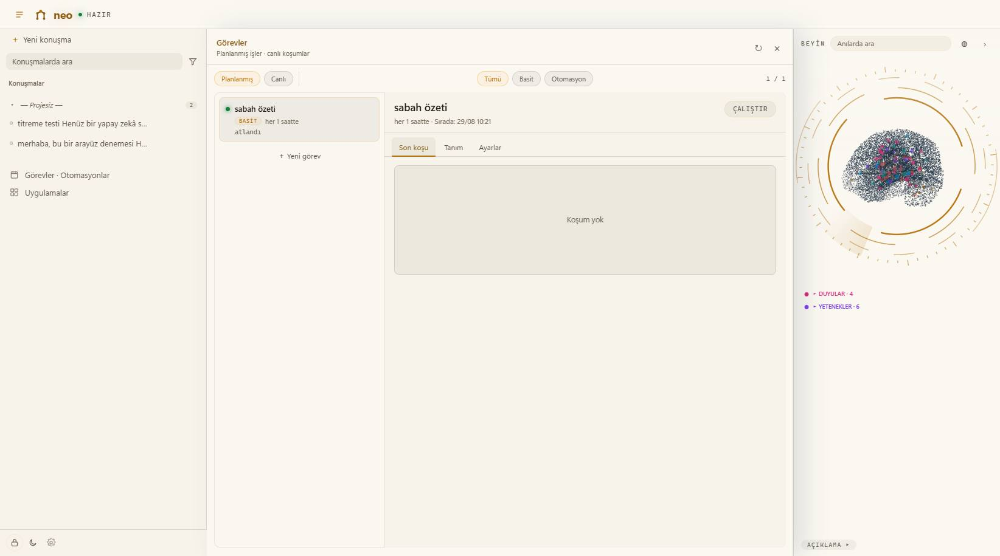
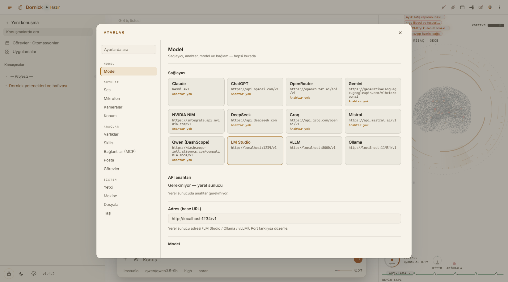

# neo

**Yaşayan, beyin-gibi hafızalı, yerel-öncelikli kişisel yapay zekâ ajanı.**

[English README](README.md)

neo bir kod asistanı değil. Bilgisayarında yaşayan, bilgisayarı senin
kullandığın gibi kullanabilen — ekran, fare, klavye, tarayıcı, dosyalar —
ve hafızası, hedefleri, geçmişi birinci sınıf, sorgulanabilir yapılar olan
kişisel bir ajan. Senin hakkında öğrendikleri, ekranda büyüdüğünü
izleyebildiğin bir hafıza ağına yazılır.


## İçinde ne var

* **Yaşayan hafıza.** Her konuşma anı bırakır. Hatırlama SQLite FTS5
  indeksi + 256-bit parmak izi (SimHash) katmanından gelir — karşılaştırma
  başına tek XOR — bu yüzden 1 anıda da 50.000 anıda da hatırlama süresi
  ~sabittir. Yeni anı en yakın komşularına kendiliğinden bağlanır; ağ
  zamanla kendini örer.
* **Kendine ait minik bir beyin.** 10.8M parametrelik bayt-düzeyi model
  (*taban yazıcı*), hafıza aramasından önce soruyu eş anlamlılar,
  kısaltmalar ve zamir çözümleriyle genişletir. Saf numpy ile CPU'da,
  milisaniyelerde, tamamen çevrimdışı koşar. Repoyla birlikte gelir
  (`src/neocp/assets/taban.npz`, ~20 MB).
* **"Beni tanı" gece okulu.** Anahtar açıksa neo, taban yazıcısını *senin*
  anılarınla, gece, senin makinende, düşük öncelikle ince ayarlar. Her aday
  model bir sınav kapısından geçmek zorundadır — benchmark'ta mevcut modeli
  geçecek, tuzak sorularda susacak, hızlı kalacak — yoksa çöpe gider.
  Verin bilgisayardan çıkmaz.
* **Koşarken izlediğin otomasyonlar.** Tekrarlayan bir iş — "her sabah
  postalarımı oku, önemlileri seç, WhatsApp'tan at" — her seferinde yeniden
  yazdığın bir istem değil, adımlardan oluşan bir grafik oluyor. Ajana söyle,
  akışı o kursun; istediğin adımı açıp elle düzenle. Adımlar koşarken
  renkleniyor, çıktı aynı ekranda kalıyor. Bir adım bozulursa neo onu bir kez
  onarıp yeniden deniyor — ama SENİN elle düzenlediğin adıma asla dokunmuyor
  ve ne değiştirdiğini her zaman söylüyor.
* **Bilgisayar kullanımı.** Ekran görüntüsü, fare/klavye kontrolü, pencere
  yönetimi ve DevTools protokolüyle sürülen gerçek bir tarayıcı
  (`neo chrome`) — oturumlar kendi profilinde kalıcıdır, formlar doldurulur,
  konsol ve ağ günlüğü okunur: "sayfa açıldı" ile "sayfa çalışıyor" ayrı
  şeylerdir.
* **Kendi projende çalışır.** neo'yu bir proje klasörüne yönlendir, işi
  *orada* yapar — kenardaki bir kum havuzunda değil. Yazdığı her dosya
  yazıldığı anda kendi dilinde denetlenir (`compile()`, `php -l`,
  `node --check`, `tsc`, ruff) ve `kos` aracı projenin **gerçek** test
  komutunu kanıta bakarak bulup çalıştırır. Gerekçelendiremediği bir test
  komutunu asla uydurmaz.
* **Senin kuralın, uygulanır.** `.neocp/kancalar.json` ile herhangi bir
  aracın öncesine ya da sonrasına kendi komutunu koyarsın; sıfırdan farklı
  çıkış aracı **veto eder**. Bilerek izin penceresinin dışında — kendi kuralın
  senden izin istemez — ve kanca dosyası modele kapalıdır: yazma araçları yola
  bakıp reddediyor, dosyanın adını anan başka bir **değiştiren** çağrı (örneğin
  bir kabuk komutu) izin kapısından önce reddediliyor. Okumak serbest; model
  hangi kuralın altında çalıştığını bilmeli. Sınırı dürüstçe: bu, bir kancayı
  yolunda engel gören modeli durdurur, adı bilerek gizleyeni değil — ona karşı
  çit izin motorudur.
* **Dış kapı (API).** Başka ajanlar ve araçlar neo'yla programla konuşabilir:
  `127.0.0.1`'e `POST /api/gate`, gövde `{"text": "..."}` — yanıtın tamamı
  döner. Varsayılan kapalı.
* **MCP bağlayıcıları ve yetenekler.** Ayar sayfasından Model Context
  Protocol sunucuları bağlanır; neo ayrıca kendi yeteneklerini
  (öğrenip yeniden kullandığı küçük betikler) kendisi yazar ve saklar.
* **Modelden bağımsız.** Anthropic API ya da OpenAI-uyumlu her sunucu —
  LM Studio, Ollama, vLLM, llama.cpp, OpenRouter.
* **Türkçe ve İngilizce** arayüz; hafıza katmanı sondan eklemeli Türkçe
  için kurulmuştur (önek eşleyen FTS) ve İngilizcede de çalışır.


## Hızlı başlangıç

### Kurulum sihirbazıyla (Windows)

[Releases](../../releases) sayfasından `neo-setup-<sürüm>.exe` indir,
çalıştır, Başlat menüsünden **neo**'yu aç. Uygulamanın ayar sayfasından
model seçilir (yerel sunucu ya da API anahtarı). İsteğe bağlı
bileşenler: beni tanı eğitimi, dinleme (mikrofon), kamera izleme.

**Var olan kurulumun üstüne kurarken** üç seçenek çıkıyor ve kurulum üçü için
de test edilmiş durumda:

| seçenek | koda ne olur | verine ne olur |
|---|---|---|
| **Güncelle** (varsayılan) | yenilenir | **korunur** — anılar, görevler, otomasyonlar aynen kalır |
| **Temiz kurulum** | silinip sıfırdan yazılır | **korunur** |
| **Verileri de sıfırla** | silinip sıfırdan yazılır | silinir — ama **önce** yedek zip'i yazılır |

Hiçbir şey silinmeden önce yedek alınıyor; yedek alınamazsa hiçbir şey
silinmiyor. Son beş yedek saklanıyor. Kaldırma, programı siler ve `.neocp`
verini yerinde bırakır.

### Kaynaktan

```bash
git clone https://github.com/fatihkutuk/neo
cd neo
pip install -e ".[app,local]"
neocp setup     # LM Studio / Ollama / vLLM / API anahtarlarını yoklar
neocp --app     # masaüstü penceresi (WebView2)
```

| komut | ne yapar |
|---|---|
| `neocp --app` | masaüstü penceresi |
| `neocp` | terminalde |
| `neocp --web` | tarayıcıda, `127.0.0.1:8765` |
| `neocp --resume` | son oturumu sürdürür |
| `neocp --mode plan` | salt okunur başlatır |

İlk açılışta zihin boştur. Konuştukça kendi kendine dolar; ikinci oturumda
seni hatırlamaya başlar.

## Otomasyonlar


Her düğüm türünü (`mail_read`, `agent`, `http`, `skill`), ihtiyaç duyduğu
gizli alanları ve elle düzenlenip düzenlenmediğini yazar — ✎ *manual* işaretli
bir adıma otomatik onarım asla dokunmaz. Aynı ekran iki temada da çalışır:



Zamana bağla, ya da **Run**'a bas ve adımların *koşuyor*dan *bitti*ye
dönüşünü izle. Hiçbir şey ayrı bir günlüğe saklanmıyor.

## Mimari

### Hafıza akışı


Soru önce taban yazıcıdan geçer; arama için gerçekten gereken terimler
(eş anlamlılar, açılımlar, çözülmüş zamirler) eklenir — eklenecek bir şey
yoksa model susar. Genişletilmiş sorgu iki indekse birden vurur (terim
kataloğu + parmak izleri), kalibre bir birleşim adayları süzer ve modelin
bağlamına yalnızca ilgili kartlar ulaşır.

Projenin ölçek benchmark'ında ölçülen:

* hatırlama isabeti, taban yazıcı öndeyken **0.87 → 0.93**
* eş anlamlıyla sorulmuş sorular **0.50 → 1.00**
* tam sorgu genişletme CPU'da ~**300 ms**, mesaj başına bir kez; erken
  susma (eklenecek şey yok) 50 ms'nin altında
* hatırlama gecikmesi 1 kayıtta da 50.001 kayıtta da ~**0.05 ms**

### Gece okulu


Gecelik kişisel döngü yeni anıları hasat eder, onlardan soru→terim
çiftleri damıtır, taban modeli düşük öncelikle ince ayarlar ve adayı
sınava sokar. Yalnızca konuşlu modeli geçen aday konuşlanır. Her şey
yerelde koşar.

### Ayarlar



## Eğitim düzeneği

[`training/`](training/) dizini taban yazıcının tam, kendine yeter eğitim
düzeneğini içerir — **verisiyle birlikte**: ~164.5k örneklik iki dilli
öğretmen korpusu, eğitilmiş taban checkpoint'i
(`training/checkpoints/base.pt`) ve korpus üretiminden kabul sınavına ve
gecelik kişisel döngüye kadar bütün betikler. İsteyen modeli yeniden
eğitebilir ya da ileri götürebilir; hat, dondurulmuş veri biçimi ve
oynamaya değer vidalar için bkz. [`training/README.md`](training/README.md)
(bu klasörün kodu, ML topluluğu okuyabilsin diye İngilizce adlandırılmıştır).


## Değerlendirme

neo'ya dış kapı API'sinden üç kodlama görevi (kolay / orta / zor) verdik ve her
çıktıyı bağımsız denetledik — sonra aynı görevleri hem değerlendiricinin
kendisiyle hem de neo'nun kendi modelinin **çıplak, tek atış** haliyle koşturduk.
neo **294/300** aldı: değerlendiricisiyle baş başa (289) ve kendi çıplak
modelinin (280) önünde — aynı model, kabuk içinde +14 puan ve sıfır bozuk
teslimat.

O puanlama elle yapılmıştı; bu yüzden depoda yaşayan bir düzeneğe dönüştü:
[`eval/coding/`](eval/coding/README.md). Python, Node ve PHP'de dokuz görev;
her biri kendi geçici alanında, boş bir zihinle, kendi neo örneğiyle koşuyor
ve puanlayıcı dosya var mı diye bakmak yerine **teslim edilen kodu
çalıştırıyor**. Orta sınıf bir modelle güncel taban: dokuz görevin tamamında
**92,3/100** — ve daha faydalısı, davranış sütunlarının ortaya çıkardığı üç
adı konmuş zayıflık. En keskini: bir görev 14 geçen test, 18 gerçek iddia ve
her sorguda 1 ile çıkan bir komut satırıyla teslim edildi; çünkü testler
fonksiyonları kapsamış, kullanıcının yazacağı komutu hiçbir şey
çalıştırmamıştı. Tam rapor: [docs/evaluation.tr.md](docs/evaluation.tr.md)
([English](docs/evaluation.md)).

## Yol haritası

Tam ajanlık eşdeğerlik haritası için bkz. [docs/parity.md](docs/parity.md) —
neyin piyasa standardını yakaladığı, neo'nun nerede önde olduğu
(kullanıcısını öğrenen model, yaşayan hafıza, MCP-sunucusu-hafıza, dış kapı)
ve nelerin bilinçle ertelendiği:

* OS-seviyesi kabuk hapsi; `semboller` aracının arkasındaki `ast`/regex
  yaklaşımı yerine gerçek bir LSP
* Tipli alt-ajan tanımları; MCP istemci tarafı OAuth
* Hafızayla beslenen kodlama — kodlama boru hattı hâlâ boş zihinle koşuyor
* Daha güçlü İngilizce taban modeli; daha geniş platform desteği (bugün Windows-öncelikli)

## Katkı

Özellik dalı → pull request → `main` (korumalı). Bkz.
[CONTRIBUTING.md](CONTRIBUTING.md). Not: proje geleneği gereği **kod
kimlikleri ve yorumlar Türkçedir**.

## Emeği geçenler

neo, **Fatih Kütük** ve **Claude'un (Anthropic)** birlikte yürüttüğü bir
geliştirmedir — bu depodaki mimari, kod ve fikirler o ortak çalışmadan
doğdu.

## Lisans

[MIT](LICENSE) © 2026 Fatih Kütük
