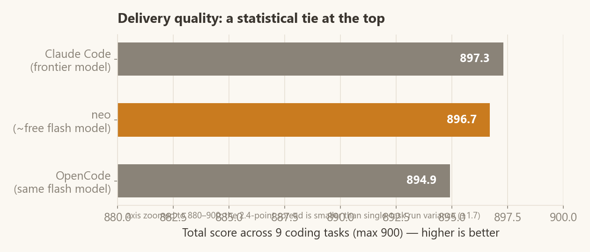
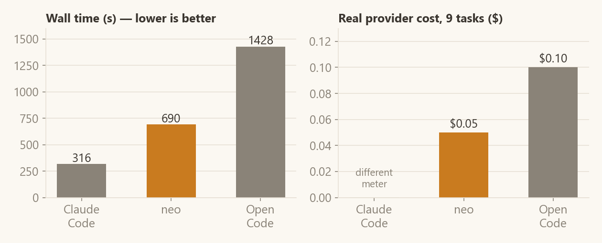
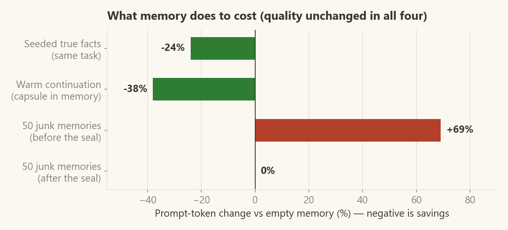

# The Benchmark — August 2026

One page, everything measured, nothing mocked. Three harnesses, nine
coding tasks, one grader that **executes the delivered code**. Raw data:
[`eval/coding/results/`](../eval/coding/results/). Re-run it yourself:
[`eval/`](../eval/README.md).

## 1 · Quality

| Harness | Model | Total /900 |
|---|---|---|
| Claude Code (reference) | Anthropic frontier | 897.3 |
| **neo** | `z-ai/glm-5.3-flash` (~free) | **896.7** |
| OpenCode 1.2.27 | `z-ai/glm-5.3-flash` (same) | 894.9 |

**Verdict: a three-way tie in quality.** The 2.4-point spread is smaller
than the run-to-run variance of one hard task (±1.7 between neo's two
repetitions of the same task). Two narrower claims *are* supported:

* A ~free flash model inside neo's harness matches the frontier reference
  on delivery quality.
* neo beats the same-model competitor — on OpenCode's best run (its worst
  burned a 32,000-token reasoning spiral and scored 0 on a hard task; neo
  caps that failure mode).

A confirmation sweep after the last harness rule landed scored 896.8 —
the tie holds. We do not claim a pass we did not measure.

**Three methodological caveats, before anything else** (raised in external
review, and correct):

1. **The benchmark is saturated.** All three harnesses score 100 on seven
   of the nine tasks. A suite this easy cannot rank the harnesses; it can
   only say all three clear this difficulty. A harder task band
   (target scores 60–90) is the roadmap's next item.
2. **neo's number is in-sample.** Several of neo's harness rules
   (the negative-requirement gate, the reasoning-effort cap) were written
   while looking at failures *on these very tasks*. OpenCode and Claude
   Code received no such tuning round. Until a held-out task set exists,
   896.7 is an in-sample figure and should be read as such.
3. **~1 point of the 2.4-point spread was a grader artifact.** The
   assertion counter missed the whole unittest family
   (`assertTrue`, `assertIn`, …), so unittest-style suites lost test
   points for style, not quality. The ruler is fixed
   ([`grading.py`](../eval/coding/grading.py)); published numbers were
   left as measured, with this note.

Given all that, the sentence this data actually supports is narrower and
still worth having: **on nine tasks that all three harnesses handle, neo
delivers the same quality as OpenCode on the same ~free model at half the
wall time and half the cost, and never burns a run on a reasoning
spiral.**

Per-task scores (0–100, higher is better; neo = mean of 2 reps)

| Task | difficulty | Claude Code | OpenCode | neo |
|---|---|---|---|---|
| k1 TCKN validator + tests | easy | **100.0** | 98.0 | 99.0 |
| k2 todo CLI (Node) | easy | 100.0 | 100.0 | 100.0 |
| k3 invoice repair (PHP) | easy | 100.0 | 100.0 | 100.0 |
| o1 CSV sales report | medium | 100.0 | 100.0 | 100.0 |
| o2 short-link HTTP service | medium | 98.7 | **100.0** | 99.3 |
| o3 lending feature (Node) | medium | 100.0 | 100.0 | 100.0 |
| z1 SQLite note search | hard | **98.7** | 97.0 | 98.3 |
| z2 PHP admin panel + auth | hard | **100.0** | 99.9 | **100.0** |
| z3 hidden-bug repair | hard | 100.0 | 100.0 | 100.0 |

## 2 · Efficiency

The only fair speed comparison is between the same-model lanes: **neo is
~2× faster and ~2× cheaper than OpenCode**, with an 85% prompt-cache hit
rate (65–92% per task). Claude Code's 316 s is a different model's token
rate — shown for context, not compared.

## 3 · Memory

Claim under test: *recall should cut cost without hurting quality.*
Quality was unchanged in **all four** experiments; only cost moved.

* **Seeded true facts** (4 real workspace facts vs empty mind, same task
  ×2): the agent skipped a discovery call — **−24% prompt tokens**, and in
  one repetition memory carried the score from 82 to 100.
* **Warm continuation** (the end-of-run capsule neo writes automatically):
  a new session continuing the work ran **5 calls / 26 s vs 8 calls /
  62 s** cold — −38% tokens. Boundary: this pays on *discovery*, not on
  edits — a file you are about to edit must be read regardless.
* **Pollution attack** (50 irrelevant memories): junk used to leak into
  the prompt through a single-stem overlap (+69% tokens on the worst
  rep). The gate is sealed; the same attack now injects **zero** blocks,
  with recall of true positives unchanged (hit-rate 0.78 = ungated;
  precision 0.54 → 0.64; silence-on-trap 0.38 → 0.62 on the
  [100-memory/70-query bench](../eval/context_memory/README.md)).
* **Memory ON across the whole 9-task suite** (one persistent mind, tasks
  unrelated to each other): quality parity with the empty-mind run
  (99.6% vs 99.7% on the 8 comparable tasks) at ~+9% tokens — accumulated
  memory of *unrelated* work neither helps nor hurts delivery. Memory
  earns its keep on **related** work, which is what the two green bars
  measure.

## 4 · What the harness adds over the raw model

Each mechanism exists because a measured failure demanded it; each has a
regression test in [`tests/`](../tests/):

1. **Delivery gates** — "done" is bounced once when a written CLI was
   never executed, a written test file was never run (a red suite got
   shipped exactly this way), the task list has open items, or the last
   run was red. The negative-requirement rule ("prove the *forbidden*
   paths too") took the auth-panel task from 55.9 to 100.
2. **Reasoning-effort cap for flash-class models** — uncapped thinking
   turned an 11-call task into a 900-second timeout and, in the
   competitor, a 32k-token spiral delivering nothing.
3. **Prompt-cache markers** — 65–92% cache-read measured on OpenRouter.
4. **Teach-first tool errors** — known shell traps are documented in the
   tool description *before* the first failure; repeated unknown errors
   become persistent lessons attached to the next occurrence.
5. **Whitespace-tolerant edits** — CRLF/trailing-space/uniform-indent
   drift no longer wastes turns; uniqueness is still required.

## Method, honestly

* neo and OpenCode: same model, separate API keys, one fresh workspace and
  an **empty mind** per task (except the memory-ON sweep above), default
  settings, neo from source.
* Claude Code is the evaluating agent itself on its own model — a
  reference line, not a same-model comparison. Its lane was worked
  honestly: same briefs, no peeking at graders, scored by the same rubric.
* neo's headline is a **mean of 2 repetitions**; no best-of anywhere.
  Flash-class variance is real — treat any single run (including these)
  with suspicion.
* neo's numbers trace to run JSONs in
  [`eval/coding/results/`](../eval/coding/results/) with per-run
  behaviour columns (model calls, tool errors, cache tokens, cost).
  The competitor lanes' raw data — OpenCode's own JSON event streams and
  the Claude-lane deliverables scored by this repo's grader — are in
  [`results/competitors/`](../eval/coding/results/competitors/), and the
  memory experiments' raw outputs in
  [`results/memory-experiments/`](../eval/coding/results/memory-experiments/).
  One honest gap remains: the Claude lane's token/cost cannot be metered
  (different billing), and its wall time was stopwatch-measured.

*Screenshots of the product: [gallery](gallery/README.md) · Drive neo from
your own harness: [the gate](gate.md).*
