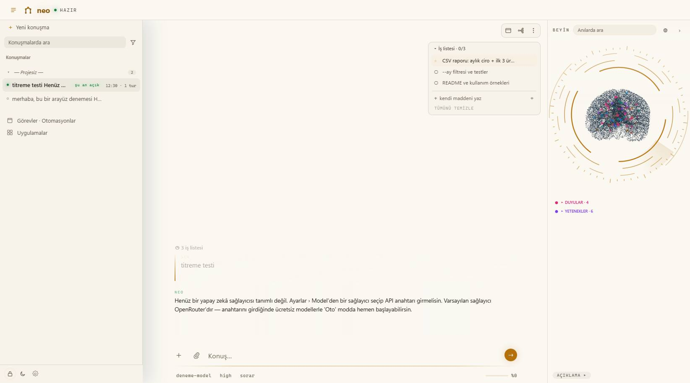
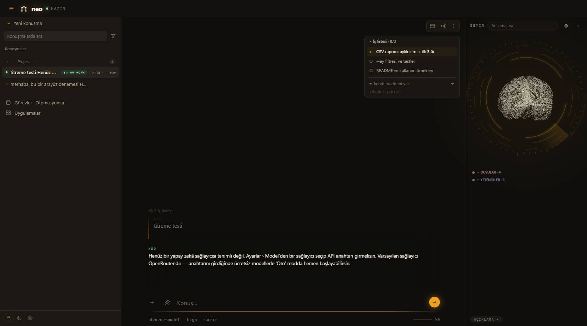
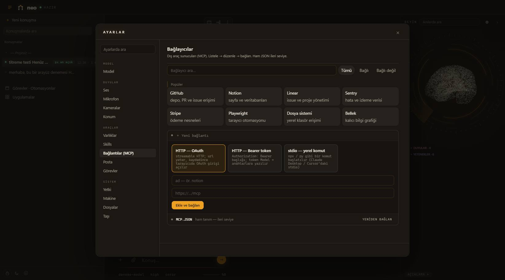
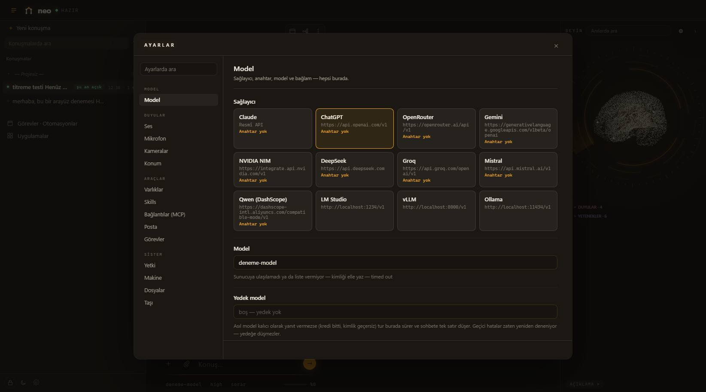
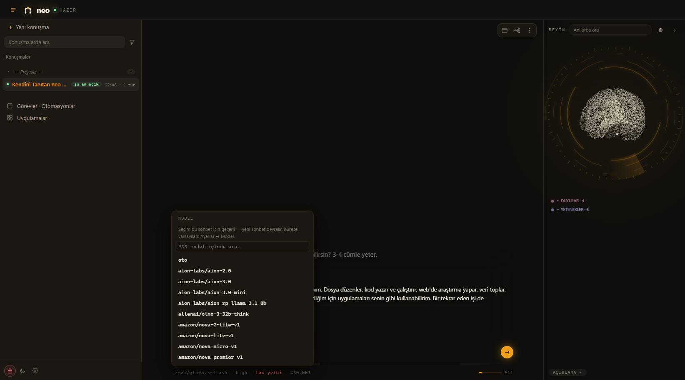
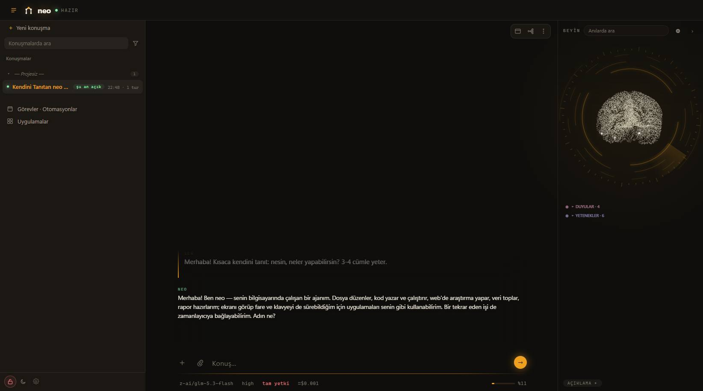

# Gallery

Screenshots taken from a live instance (no mockups). The conversation in the
last shot is a real exchange with `z-ai/glm-5.3-flash` through OpenRouter —
including the session title the model wrote for itself in the sidebar.

| | |
|---|---|
|  **Light theme** — permanent sidebar, chat center, brain panel right, editable task list |  **Dark theme** — same layout, warm dark palette |
|  **Task list** — the agent's own work items; complete, remove or add yours in place |  **Viewer tabs** — opening a second file keeps the first one a click away |
|  **Connectors directory** — search, status filters, one-click popular MCP servers |  **Model settings** — providers, keys, context window |
|  **Per-chat model** — each conversation can pin its own model; new chats inherit |  **Live session** — real model, real cost meter, model-written session title |
