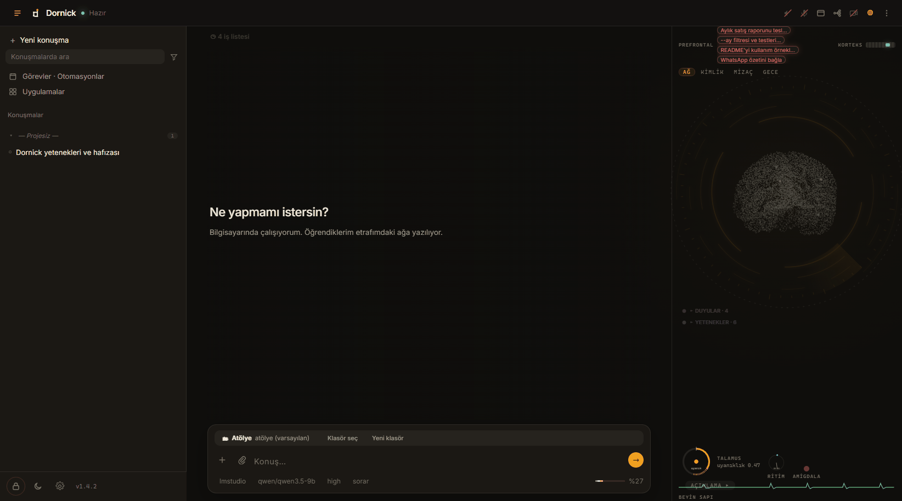
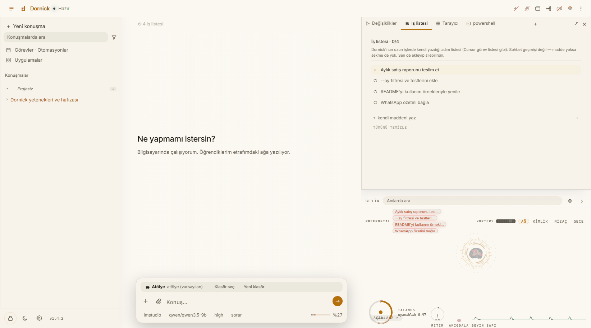
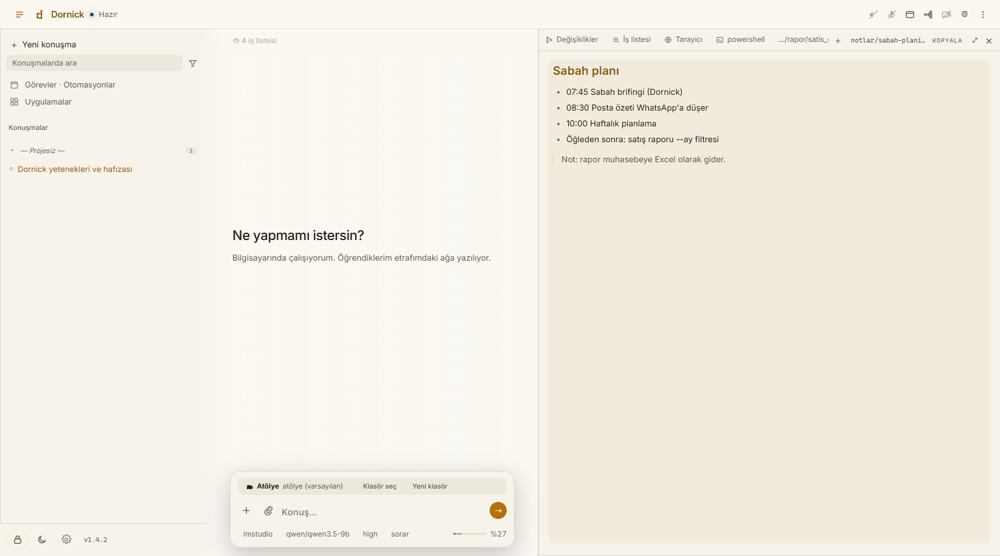
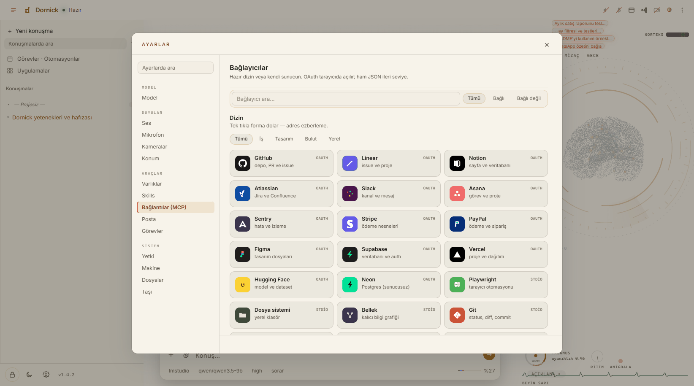
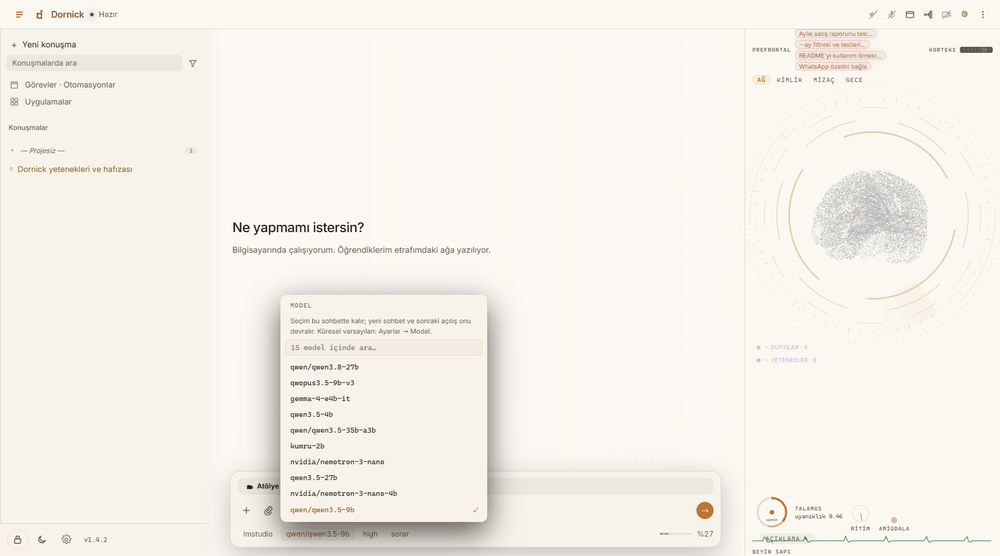
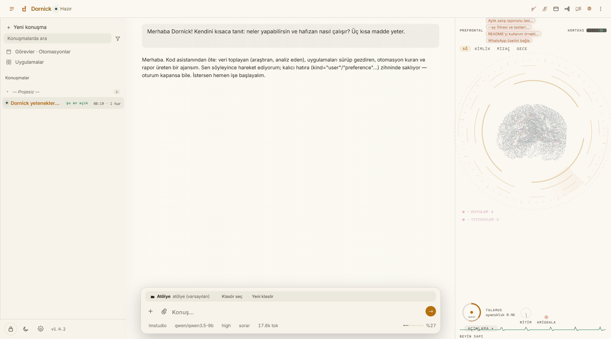

# Gallery

Screenshots from a live instance (Dornick 1.4.2, Turkish UI) — no mockups.
The last shot is a real exchange with a local model, `qwen/qwen3.5-9b`
served by LM Studio, no API key involved; the session title in the sidebar
was written by the model itself.

## Shell

| Light | Dark |
|---|---|
|  |  |

Permanent conversation sidebar on the left, chat in the center, the memory
brain on the right — with its regions around the network: the prefrontal
goal strip, the cortex band, the thalamus gauge and the brainstem pulse.
Both themes ship first-class.

## Working surfaces

| | |
|---|---|
|  |  |
| **Task list** — the agent's own work items, a tab in the viewer; check off, remove, or add yours in place. | **Viewer tabs** — opening a second file keeps the first a click away; the changes, task list, browser and terminal tabs stay pinned. |

## Settings

| | |
|---|---|
|  |  |
| **Connectors directory** — search, connected/not-connected filters, one-click OAuth and stdio MCP servers. | **Model settings** — providers, keys, address, context window; a local server needs no key. |

## Models

| | |
|---|---|
|  |  |
| **Per-chat model** — every conversation can pin its own model; new chats inherit the last choice. | **Live session** — a real local model, the token meter in the dock, model-written title. |
